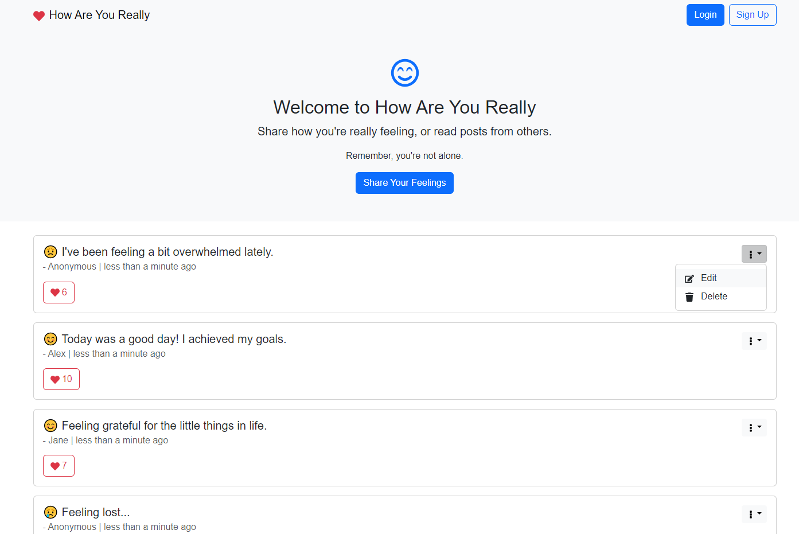
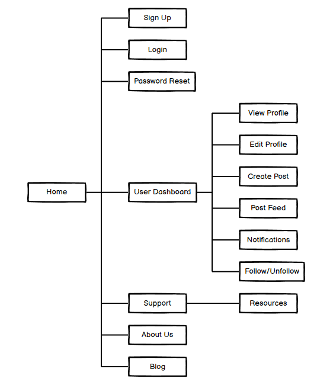
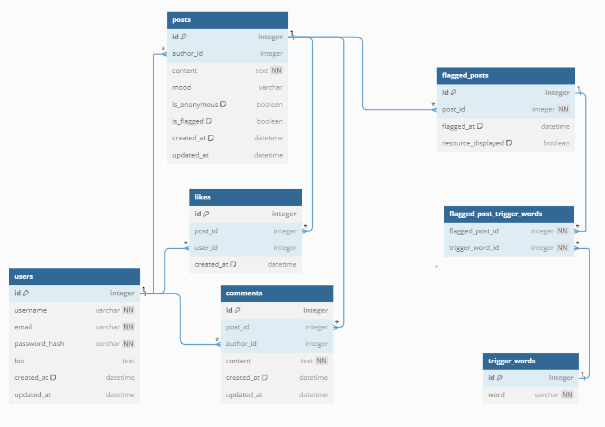
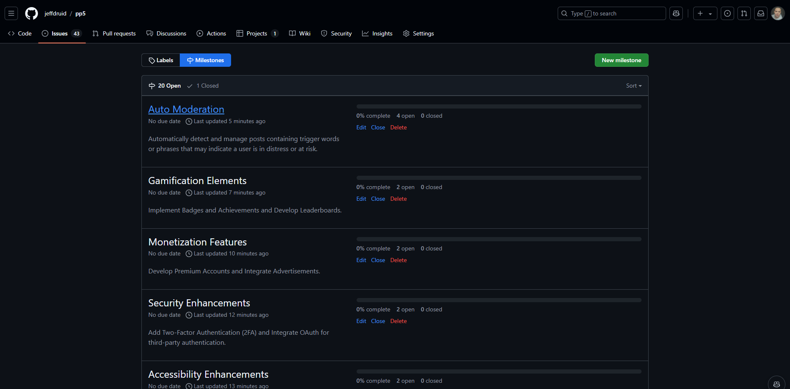
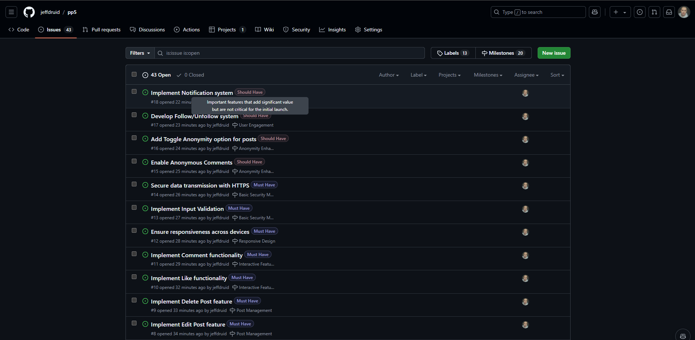

# [How Are You Really - Full Stack Web Application](https://pp5-jeff-d4728660c25d.herokuapp.com/#home)

## Introduction

**How Are You Really** is a full-stack web application designed to provide users with a platform to share their feelings, thoughts, and experiences. Inspired by social media platforms, it emphasizes anonymity and genuine expression, allowing users to connect and support each other in a safe environment.

View the live project [here](https://pp5-jeff-d4728660c25d.herokuapp.com/)

## Project Objectives

### Primary Goals

- Facilitate Emotional Expression: Provide users with a safe and supportive platform to share their feelings and thoughts.
- Ensure User Anonymity: Allow users to post anonymously to encourage genuine and honest expression without fear of judgment.
- Promote Community Engagement: Enable interactions through likes, comments, and follows to build a supportive community.
- Maintain Data Security and Privacy: Protect user data and ensure secure authentication and authorization processes.
- Deliver an Intuitive and Responsive UI/UX: Create a user-friendly interface that is accessible across various devices.

## Table of Contents
- TODO
1. [Introduction](#introduction)
2. [Technologies Used](#technologies-used)
3. [User Stories](#user-stories)
4. [Wireframes](#wireframes)
   - [Site Map](#site-map)
   - [Database Schema](#database-schema)
5. [Features](#features)
6. [MoSCoW Prioritization](#moscow-prioritization)
   - [Must Have](#must-have)
   - [Should Have](#should-have)
   - [Could Have](#could-have)
   - [Won't Have (for now)](#wont-have-for-now)
6. [GitHub Projects, Milestones, and Issues](#github-projects-milestones-and-issues)
   - [GitHub Projects](#github-projects)
   - [Milestones](#milestones)
   - [Issues](#issues)
6. [Troubleshooting](#troubleshooting)
   - [Password Reset](#password-reset)
7. [Testing](#testing)
8. [Bugs](#bugs)
   - [Fixed Bugs](#fixed-bugs)
9. [UI Improvements](#ui-improvements)
10. [Future Improvements](#future-improvements)
11. [Setup](#setup)
    - [Prerequisites](#prerequisites)
    - [Installation](#installation)
    - [Usage](#usage)
12. [Deployment](#deployment)
    - [Cloning & Forking](#cloning--forking)
    - [Local Deployment](#local-deployment)
    - [Remote Deployment (Heroku)](#remote-deployment-heroku)
13. [Credits](#credits)
    - [Source Code](#source-code)
    - [Useful links](#useful-links)
    - [Tools](#tools)
    - [Resources](#resources)
14. [License](#license)

## Technologies Used
 - [React](https://reactjs.org/)
  - [React Bootstrap](https://react-bootstrap.github.io/)
  - [React Icons](https://react-icons.github.io/react-icons/)
  - [date-fns](https://date-fns.org/) for date formatting

## User Stories

### Users Should:
- **Sign Up** for a new account to start using the platform.
- **Login** to their account to access personalized features.
- **Create Posts** with mood selection, content input, and an option to post anonymously.
- **View Posts** from other users in a responsive feed.
- **Like Posts** to show appreciation.
- **Edit and Delete** their own posts.
- **Comment on Posts** to engage in conversations.
- **View and Edit Profile** to manage personal information.
- **Receive Notifications** for interactions on their posts.

### Users Should Not:
- **Edit or Delete** posts made by other users.
- **Access** content without proper authentication.
- **Share Personal Information** without consent if posting anonymously.

## Wireframes:

#### Site Map
- The site map visually outlines the structure of the website, showing the relationships between different pages and sections. It provides an overview of how users will navigate through the platform, ensuring an intuitive user experience.
- 

#### Database Schema
- The database schema diagram illustrates the data model used in the application. It includes the tables, their relationships, and key fields, ensuring data integrity and efficient data management.

TODO - add Following
- 

## Features
- TODO - add screenshots
### 1. User Authentication
- **Sign Up and Login**: Users can create an account or log in using modals.
- **Authentication State Management**: Simulated authentication state for demonstration purposes.

### 2. User Profiles
- **View Profile**: Users can view their profile details including username, email, and bio.
- **Edit Profile**: Users can update their profile information through a modal.

### 3. Post Creation and Management
- **Create Post**: Users can create new posts with mood selection, content input, and anonymity option.
- **Edit Post**: Users can edit their existing posts through a pre-filled modal.
- **Delete Post**: Users can delete their posts with confirmation prompts.

### 4. Interactive Feed
- **View Posts**: Posts are displayed in a feed with mood icons, content, author, timestamp, and like count.
- **Like Posts**: Users can like posts to show appreciation.
- **Comment on Posts**: Users can add comments to posts to engage in conversations.

### 5. Comment Section
- **Add Comments**: Users can add comments to any post.
- **View Comments**: Comments are displayed beneath each post with author and timestamp.
### 6. Responsive Design
- **Mobile-Friendly**: The application is optimized for various devices using React Bootstrap.
- **Accessible UI**: Emphasis on user-friendly interfaces with modals, buttons, and intuitive navigation.

## MoSCoW Prioritization
- The MoSCoW method is used to prioritize features based on their importance and urgency. Features are categorized into Must Have, Should Have, Could Have, and Won't Have for the current version of the application.

### Must Have
These are essential features without which the project cannot function effectively.

#### User Authentication

- Sign Up: Allow users to create an account.
- Login/Logout: Enable users to access and exit their accounts securely.
- Password Reset: Provide functionality for users to reset forgotten passwords.
User Profiles

- View Profile: Users can view their profile information.
- Edit Profile: Users can update their profile details (username, email, bio).

#### Post Management

- Create Post: Users can create new posts with mood selection, content input, and anonymity option.
- View Posts: Display a feed of posts from all users.
- Edit Post: Allow users to edit their own posts.
- Delete Post: Enable users to delete their own posts.

#### Interactive Features

- Like Posts: Users can like posts to show appreciation.
- Comment on Posts: Users can add comments to posts to engage in discussions.

#### Responsive Design

- Ensure the application is fully responsive and functional on desktops, tablets, and mobile devices.

#### Basic Security Measures

- Input Validation: Validate user inputs to prevent malicious data entry.
- Secure Data Transmission: Use HTTPS to encrypt data between the client and server.

### Should Have
- Important features that add significant value but are not critical for the initial launch.

#### Anonymity Enhancements

- Anonymous Comments: Allow users to comment anonymously.
- Toggle Anonymity: Users can choose to toggle anonymity for individual posts.

#### User Engagement

- Follow System: Allow users to follow/unfollow other users.
- Notifications: Notify users when their posts receive likes or comments.

#### Post Features

- Mood Analytics: Provide insights into the distribution of moods in posts.
- Search and Filter: Enable users to search posts by keywords or filter by mood.

##### Enhanced UI/UX

- Dark Mode: Provide a toggle between light and dark themes.
- Animations and Transitions: Add subtle animations to improve user experience.

#### Performance Optimization

- Lazy Loading: Implement lazy loading for images and posts to enhance performance.
- Pagination: Add pagination or infinite scroll to manage large feeds efficiently.

### Could Have
Desirable features that can further enhance the project but are not essential.

#### Media Support

- Image Uploads: Allow users to upload images with their posts.
- Avatar Customization: Enable users to upload or choose avatars for their profiles.

#### Real-Time Features

- Live Notifications: Implement real-time notifications using WebSockets or similar technologies.
- Real-Time Updates: Display new posts, likes, and comments in real-time without page refreshes.

#### Advanced Commenting

- Nested Comments: Allow users to reply to specific comments, creating threaded discussions.
- Comment Likes: Enable users to like comments.

#### Analytics Dashboard

- Provide users with insights into their activity, such as number of posts, likes received, and comments.

#### Accessibility Enhancements

- Ensure the application meets WCAG standards by implementing ARIA labels and keyboard navigation support.

### Won't Have (for now)
Features that are out of scope for the current project phase but can be considered for future iterations.

#### User Following System Enhancements

- Mutual Follows: Implement mutual following logic.
- Follower Recommendations: Suggest users to follow based on interests or interactions.

#### Advanced Security Measures

- Two-Factor Authentication (2FA): Add an extra layer of security for user accounts.
- OAuth Integration: Allow users to sign up/login using third-party services like Google or Facebook.

#### Monetization Features

- Premium Accounts: Offer premium features for a subscription fee.
- Advertisements: Integrate ads to generate revenue.

#### Gamification Elements

- Badges and Achievements: Reward users for milestones like number of posts or likes.
- Leaderboards: Display top contributors based on engagement metrics.

## GitHub Projects, Milestones, and Issues

### GitHub Projects
GitHub Projects was used to manage and organize tasks. It provides a Kanban-style board that allows to visualize our workflow and track the progress of tasks.

### Milestones
Milestones are used to track the progress of significant phases in our project. Each milestone includes a set of issues that need to be completed to achieve the milestone goal.
- 

### Issues
Issues are used to track tasks, enhancements, and bugs for the project. Each issue is assigned to a team member and linked to a milestone.
- 

For more details, visit the [GitHub Project](https://github.com/users/jeffdruid/projects/4) page.

### Kanban Board

| **Milestone**                | **Issue**                                   | **Priority** | **Description**                                               |
|------------------------------|---------------------------------------------|--------------|---------------------------------------------------------------|
| **1. User Authentication**   | Implement Sign Up functionality             | Must Have    | Allow users to create a new account with username and email.  |
|                              | Implement Login/Logout functionality        | Must Have    | Enable users to log in and out securely.                      |
|                              | Implement Password Reset feature            | Must Have    | Provide password reset via email.                             |
| **2. User Profiles**         | Develop View Profile page                   | Must Have    | Users can view their profile details.                         |
|                              | Develop Edit Profile functionality          | Must Have    | Users can update their profile information (username, email, bio). |
| **3. Post Management**       | Create Post functionality                   | Must Have    | Users can create new posts with mood selection and anonymity option. |
|                              | Display Post Feed                           | Must Have    | Show a list of posts in the feed.                             |
|                              | Implement Edit Post feature                 | Must Have    | Allow users to edit their own posts.                          |
|                              | Implement Delete Post feature               | Must Have    | Allow users to delete their own posts.                        |
| **4. Interactive Features**  | Implement Like functionality                | Must Have    | Users can like posts to show appreciation.                     |
|                              | Implement Comment functionality             | Must Have    | Users can add comments to posts to engage in discussions.      |
| **5. Responsive Design**     | Ensure responsiveness across devices        | Must Have    | Optimize UI for desktop, tablet, and mobile devices.           |
| **6. Basic Security Measures**| Implement Input Validation                 | Must Have    | Validate user inputs to prevent malicious data entry.         |
|                              | Secure data transmission with HTTPS         | Must Have    | Use HTTPS for secure data transfer.                           |
| **7. Auto Moderation**      | Implement Content Filtering Algorithm       | Must Have    | Develop a simple system to detect trigger words/phrases indicating distress. |
|                              | Create Basic Trigger Words/Phrases List     | Must Have    | Develop a basic list of trigger words and phrases to monitor.      |
|                              | Develop Modal with Resources for Flagged Posts | Must Have | Display a modal with mental health resources when a post is flagged. |
|                              | Hide Flagged Posts from Feed                | Must Have    | Automatically remove or hide posts containing trigger words from the feed. |
| **8. Anonymity Enhancements**| Enable Anonymous Comments                   | Should Have  | Allow users to comment anonymously.                           |
|                              | Add Toggle Anonymity option for posts        | Should Have  | Allow users to toggle anonymity for individual posts.          |
| **9. User Engagement**       | Develop Follow/Unfollow system              | Should Have  | Users can follow or unfollow other users.                     |
|                              | Implement Notification system              | Should Have  | Notify users when their posts receive likes or comments.      |
| **10. Post Features**         | Implement Mood Analytics                    | Should Have  | Provide insights into the distribution of moods in posts.     |
|                              | Develop Search and Filter functionality     | Should Have  | Users can search posts by keywords or filter by mood.          |
| **11. Enhanced UI/UX**       | Add Dark Mode toggle                        | Should Have  | Provide a toggle between light and dark themes.               |
|                              | Integrate Animations and Transitions        | Should Have  | Add animations for modals, buttons, and interactions.          |
| **12. Performance Optimization** | Implement Lazy Loading               | Should Have  | Lazy load images and posts for better performance.             |
|                              | Add Pagination or Infinite Scroll            | Should Have  | Manage large feeds efficiently with pagination or infinite scroll. |
| **13. Media Support**        | Enable Image Uploads for posts              | Could Have   | Allow users to attach images to their posts.                   |
|                              | Allow Avatar Customization                  | Could Have   | Users can upload or choose avatars for profiles.               |
| **14. Real-Time Features**   | Integrate Live Notifications                | Could Have   | Use WebSockets to notify users in real-time.                   |
|                              | Implement Real-Time Feed Updates            | Could Have   | New posts, likes, comments update in real-time.                |
| **15. Advanced Commenting**  | Enable Nested Comments                      | Could Have   | Allow users to reply to specific comments, creating threaded discussions. |
|                              | Add Like functionality for comments         | Could Have   | Users can like comments.                                      |
| **16. Analytics Dashboard**  | Provide post performance insights           | Could Have   | Users can view analytics on their posts' performance.          |
| **17. Accessibility Enhancements** | Ensure WCAG compliance            | Could Have   | Meet accessibility standards for users with disabilities.      |
|                              | Implement ARIA labels and keyboard navigation | Could Have | Improve accessibility with ARIA and keyboard support.          |
| **18. Security Enhancements**| Add Two-Factor Authentication (2FA)         | Won't Have   | Implement 2FA for extra security.                              |
|                              | Integrate OAuth for third-party auth        | Won't Have   | Allow login via Google, Facebook, etc.                         |
| **19. Monetization Features**| Develop Premium Accounts                    | Won't Have   | Offer premium features for subscribers.                        |
|                              | Integrate Advertisements                    | Won't Have   | Show ads to generate revenue.                                  |
| **20. Gamification Elements**| Implement Badges and Achievements           | Won't Have   | Reward users for milestones like number of posts or likes.      |
|                              | Develop Leaderboards                        | Won't Have   | Show top contributors based on engagement metrics.             |

## Testing
All testing was done manually and automated using Django's built-in testing framework. The application was tested for functionality, user experience, and security. Test cases were created to cover user stories and edge cases, ensuring the application works as expected.
   - You can view all the tests [here](README/TESTING.md)

## Bugs
## Setup

### Prerequisites

### Installation

### Usage

## Deployment

### Cloning & Forking

### Local Deployment

### Remote Deployment (Heroku)

## Credits

### Useful Links

### Tools
### Tools
- [Visual Studio Code](https://code.visualstudio.com/)
- [GitHub](https://github.com)
- [Heroku](https://www.heroku.com/)
- [Database Relationship Diagrams Design Tool](https://dbdiagram.io/)
- [Site Map Design Tool - Balsamiq](https://balsamiq.com/)
- [W3C HTML Validator](https://validator.w3.org/)
- [W3C CSS Validator](https://jigsaw.w3.org/css-validator/)
- [flake8](https://flake8.pycqa.org/en/latest/)
- [Jshint](https://jshint.com/)
- [Django's Built-in Check System](https://docs.djangoproject.com/en/3.2/ref/django-admin/#check)
- [WAVE - Web Accessibility Evaluation Tool](https://wave.webaim.org/)
- [LightHouse](https://developers.google.com/web/tools/lighthouse)
- [CI Python Linter](https://pep8ci.herokuapp.com/)

### Resources
- **React Documentation**: [https://reactjs.org/docs/getting-started.html](https://reactjs.org/docs/getting-started.html)
- **React Bootstrap Documentation**: [https://react-bootstrap.github.io/](https://react-bootstrap.github.io/)
- **Django REST Framework**: [https://www.django-rest-framework.org/](https://www.django-rest-framework.org/)
- **JWT Authentication Guide**: [https://jwt.io/introduction/](https://jwt.io/introduction/)
- **Testing in React**: [https://reactjs.org/docs/testing.html](https://reactjs.org/docs/testing.html)

### License
- This project is licensed under the MIT License - see the [LICENSE](LICENSE) file for details.

**[Back to top](#table-of-contents)**